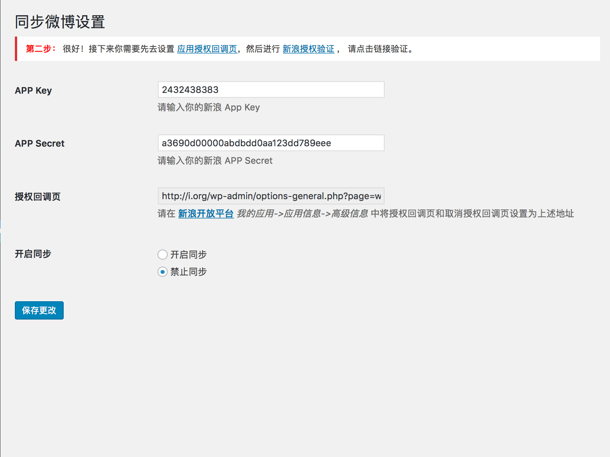

# wp2wb

发布文章时自动将文章同步发布到新浪微博

## 插件说明

wp2wb 将你的 WordPress 网站与新浪微博关联，在发布文章时自动将文章同步发布到新浪微博，并且可以选择以普通微博方式发布或者头条文章方式发布。

使用 wp2wb 需要先在 [新浪开放平台](http://open.weibo.com) 创建网站网页应用。

## 安装插件 

1. 下载插件 `zip` 压缩包，解压并上传到网站 `/wp-content/plugins` 目录，或者通过在 [插件中心](https://wordpress.org/plugins/wp2wb/) 在线下载安装
1. 在 `插件->已安装的插件` 中激活插件
1. 在 `设置->同步微博设置` 中按相关提示设置插件。

## 插件设置

1. 填写新浪 App Key 与 App Secret

2. 设置应用授权回调页并进行授权验证

3. 验证成功

4. 开启同步，并选择发布微博类型

## 版本日志

### v1.0.2

- 修复头条文章不包含文章内容的问题

### v1.0

* First version.